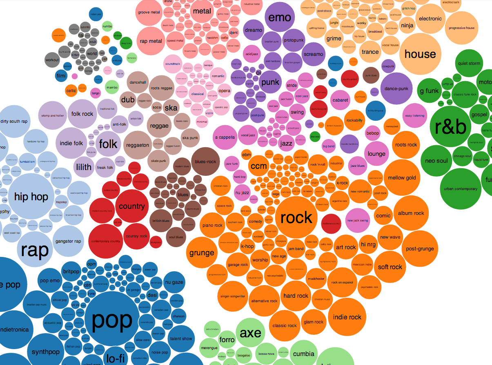
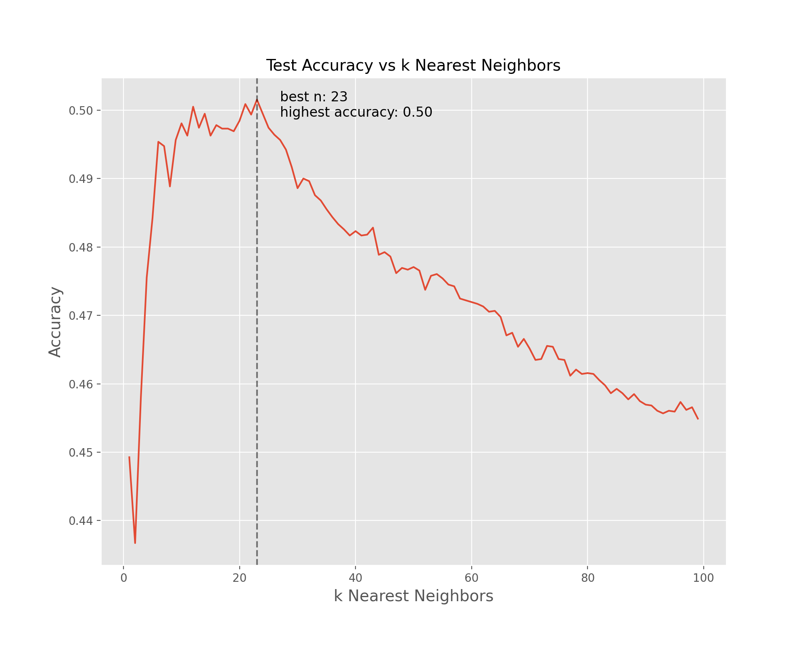

# Music-Genre-Classification
## Table of Contents
[Overview](#overview) 
[Data Pipeline](#data-pipeline) 
[Feature Engineering](#feature-engineering) 
[Exploratory Data Analysis](#exploratory-data-analysis) 
[Machine Learning](#machine-learning) 
[Summary](#summary) 
[Future Questions](#future-questions) 
[References](#references) 

## Overview
Music is everywhere. As of 2011, it was reported that there are over 79,000,000 documented songs in existence[1](http://bedtimemath.org/fun-math-songs-in-world/). These songs have been classified into hundreds of different genres and subgenres.

And yet, music is still constantly evolving. Some new genres that are expected to see major growth in 2021 are Synthwave, Ambient music, J-pop, and Nu Disco[3](https://www.ujam.com/blog/upcoming-music-trends-in-2021/). With this constant growth and expansion, it's important for businesses that work with music to be able to reliably track these updates. Spotify, as an example, may find it useful to

This project aims to generate highly accurate and reproducible machine learning models that can assess a song's genre based on its audio features.

## Data Pipeline

In order to conduct this project, I required music data that contains genre labels. This proved to be surprisingly difficult to find. The solution I found was through the Spotipy[4](https://spotipy.readthedocs.io/en/2.17.1/) Python library. Using their search[5](https://spotipy.readthedocs.io/en/2.17.1/#spotipy.client.Spotify.search) method, I was able to pull 1,000 songs (request limit) for each genre across 113 genres. This yielded basic data for each song such as the track name, artist name, album name, and of course the genre. The second step in this process was gathering the audio features for these songs. This was again done using Spotipy, this time leveraging the audio_features[6](https://spotipy.readthedocs.io/en/2.17.1/#spotipy.client.Spotify.audio_features) method.

I also want to (down the line) explore genre classification through Natural Language Processing with song lyrics so I set up a pipeline to collect lyrics using the LyricsGenius[7](https://github.com/johnwmillr/LyricsGenius) Python library.

All of the steps in this pipeline have been functionalized for reproducibility and can be accessed [here](src/datapipeline.py). An **important note**, you will need to input Spotify and Genius access tokens into the file in order for the functions to run properly.

The final dataset (omitting lyrics) contains the following features:
- **Basic Track Info:** Track Name, Artist Name, Album Name, Genre, Popularity, Duration (milliseconds), Explicit, Track ID, Artist ID
- **Audio Features:** Danceability, Energy, Key, Loudness, Mode, Speechiness, Acousticness, Instrumentalness, Liveness, Valence, Tempo

## Feature Engineering

The main changes applied to this dataset were with the "Duration" and "Explicit" features.

The duration, being in milliseconds, isn't meaningful for our purposes and is 6 to 7 orders of magnitude larger numerically than all of the other features. This could potentially have an adverse effect when training models or analyzing feature importances. This was easily fixed by converting the duration from milliseconds to seconds. The explicit feature is a boolean depicting if a song is, as you would expect, explicit. This was simply converted to an integer for ease of use for the machine learning models.

## Exploratory Data Analysis

a

## Machine Learning

72, 18, 10

## Summary

a

## Future Questions

a

## References

1. [79,000,000 Song Metric](http://bedtimemath.org/fun-math-songs-in-world/)
2. [Music Genre Visualization](https://www.chess.com/news/view/published-data-api)
3. [2021 Music Genre Trends](https://www.ujam.com/blog/upcoming-music-trends-in-2021/)
4. [Spotipy Documentation](https://spotipy.readthedocs.io/en/2.17.1/)
5. [Spotipy Search Method](https://spotipy.readthedocs.io/en/2.17.1/#spotipy.client.Spotify.search)
6. [Spotipy Audio Features Method](https://spotipy.readthedocs.io/en/2.17.1/#spotipy.client.Spotify.audio_features)
7. [LyricsGenius Documentation](https://github.com/johnwmillr/LyricsGenius)