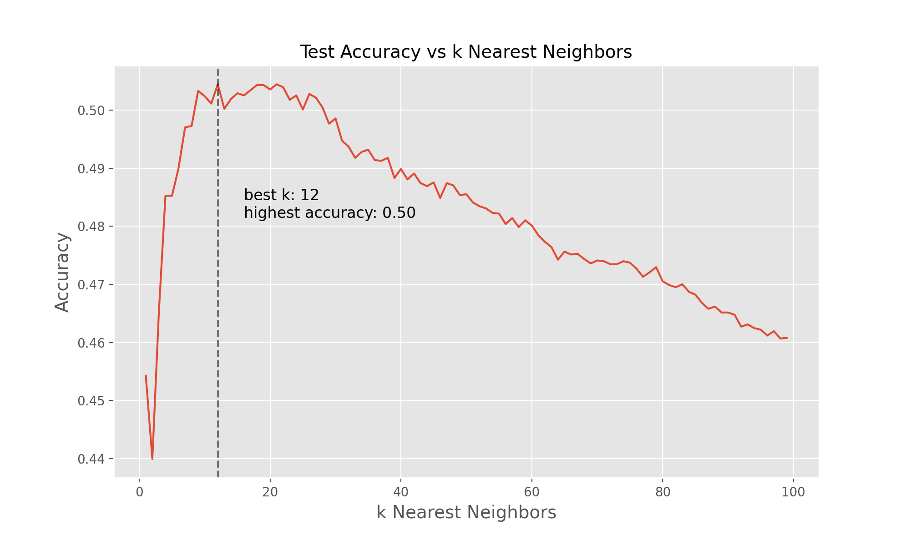

# Music-Genre-Classification
## Table of Contents
[Overview](#overview) 
[Data Pipeline](#data-pipeline) 
[Exploratory Data Analysis](#exploratory-data-analysis) 
[Feature Engineering](#feature-engineering) 
[Machine Learning](#machine-learning) 
[Summary](#summary) 
[Future Questions](#future-questions) 
[References](#references) 

## Overview
Music is everywhere. As of 2011, it was reported that there are over 79,000,000 documented songs in existence[1](http://bedtimemath.org/fun-math-songs-in-world/). These songs have been classified into hundreds of different genres and subgenres.

And yet, music is still constantly evolving. Some new genres that are expected to see major growth in 2021 are Synthwave, Ambient music, J-pop, and Nu Disco[3](https://www.ujam.com/blog/upcoming-music-trends-in-2021/). With this constant growth and expansion, it's important for businesses that work with music to be able to reliably track these updates.

This project aims to generate highly accurate and reproducible machine learning models that can assess a song's genre based on its audio features and lyrics.

## Data Preparation

a

## Exploratory Data Analysis

a

## Feature Engineering

a

## Machine Learning

## Summary

a

## Future Questions

a

## References

1. [79,000,000 Song Metric](http://bedtimemath.org/fun-math-songs-in-world/)
2. [Music Genre Visualization](https://www.chess.com/news/view/published-data-api)
3. [2021 Music Genre Trends](https://www.ujam.com/blog/upcoming-music-trends-in-2021/)