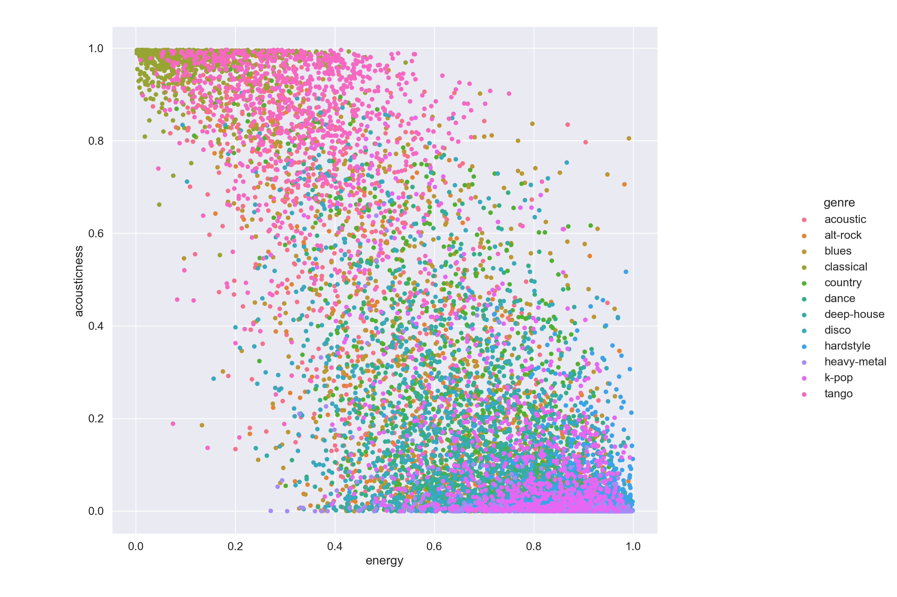

# Music-Genre-Classification
## Table of Contents
[Overview](#overview) 
[Data Pipeline](#data-pipeline) 
[Data Preparation](#data-preparation) 
[Feature Engineering](#feature-engineering) 
[Exploratory Data Analysis](#exploratory-data-analysis) 
[Machine Learning](#machine-learning) 
[Summary](#summary) 
[Future Questions](#future-questions) 
[References](#references) 

## Overview
Music is everywhere. As of 2011, it was reported that there are over 79,000,000 documented songs in existence[1](http://bedtimemath.org/fun-math-songs-in-world/). These songs have been classified into hundreds of different genres and subgenres.

And yet, music is still constantly evolving. Some new genres that are expected to see major growth in 2021 are Synthwave, Ambient music, J-pop, and Nu Disco[3](https://www.ujam.com/blog/upcoming-music-trends-in-2021/). With this constant growth and expansion, it's important for businesses that work with music to be able to reliably track these updates. Spotify, as an example, may find it useful to

This project aims to generate highly accurate and reproducible machine learning models that can predict a song's genre based on its audio features.

## Data Pipeline

In order to conduct this project, I required music data that contains genre labels. This proved to be surprisingly difficult to find. The solution I found was through the Spotipy[4](https://spotipy.readthedocs.io/en/2.17.1/) Python library. Using their search[5](https://spotipy.readthedocs.io/en/2.17.1/#spotipy.client.Spotify.search) method, I was able to pull 1,000 songs (request limit) for each genre across 113 genres. This yielded basic data for each song such as the track name, artist name, album name, and of course the genre. The second step in this process was gathering the audio features for these songs. This was again done using Spotipy, this time leveraging the audio_features[6](https://spotipy.readthedocs.io/en/2.17.1/#spotipy.client.Spotify.audio_features) method.

I also want to (down the line) explore genre classification through Natural Language Processing with song lyrics so I set up a pipeline to collect lyrics using the LyricsGenius[7](https://github.com/johnwmillr/LyricsGenius) Python library.

All of the steps in this pipeline have been functionalized for reproducibility and can be accessed [here](src/datapipeline.py). An **important note**, you will need to input Spotify and Genius access tokens into the file in order for the functions to run properly.

The final dataset (omitting lyrics) contains the following features:
- **Basic Track Info:** Track Name, Artist Name, Album Name, Genre, Popularity, Duration (milliseconds), Explicit, Track ID, Artist ID
- **Audio Features:** Danceability, Energy, Key, Loudness, Mode, Speechiness, Acousticness, Instrumentalness, Liveness, Valence, Tempo

## Data Preparation

After briefly examining the data, I noticed that there were roughly 20,000 songs that appeared multiple times in different genres in the dataset. This makes sense as songs can be classified into multiple genres. This did prove problematic, however, since my machine learning models would only be able to handle single-label classification.

In order to remedy this, I removed the duplicates shrinking my dataset down from 113,000 songs to 77,000 songs. This, in turn, imposed some major class imbalances with the largest class having 985 songs while the smallest class contained only 12 songs.

To mitigate the effects of class imbalance and to get better baseline performance from my models, I made the executive decision to handpick 12 of the largest and most diverse genres to use for my machine learning models. Each of these genres had no less than 800 songs. This resulted in a final dataset consisting of 10,843 songs. The genres I selected are: acoustic, alt-rock, blues, classical, country, dance, deep-house, disco, hardstyle, heavy-metal, k-pop, and tango.

## Feature Engineering

The main changes applied to this dataset were with the "Duration" and "Explicit" features.

The duration, being in milliseconds, isn't meaningful for our purposes and is 6 to 7 orders of magnitude larger numerically than all of the other features. This could potentially have an adverse effect when training models or analyzing feature importances. This was easily fixed by converting the duration from milliseconds to seconds. The explicit feature is a boolean depicting if a song is, as you would expect, explicit. This was simply converted to an integer for ease of use for the machine learning models.

## Exploratory Data Analysis

I started my EDA by creating a correlation matrix and looking for relationships between different audio features.

| Audio Features Correlation Matrix |
:-------------------------:|

It turns out that there are actually quite a few strong correlations observed between the different features, and many of these make sense. Songs that carry heavy acoustic qualities often tend to be lower energy when compared to, say, a club song. The valence of a song, which indicates how "happy" a song is, shares a fairly strong correlation with the song's danceability.

I wanted to see if there are any easily discernable clusters of genres across these features so I took some of the strongest correlating features and plotted them on scatter plots with the points color-coated by genre.

| Danceability vs Valence  |
:-------------------------:|

| Energy vs Loudness        |
|:-------------------------:|
|   |

| Acousticness vs Energy    |
|:-------------------------:|

Legibility between different genres is difficult because of the high number of classes but trends are still noticeable. Most notably in the Loudness vs Energy graph, we can see that blues and classical music tend to anchor towards the bottom of the chart while heavy metal and deep-house tend to sit towards the top.

## Machine Learning

The models I tested for this project are kNN, Logistic Regressoin, Random, and Gradient Boosting classifiers. Out of the box, the Random Forest and Gradient Boosting classifiers performed the best by far with a 74% and 75% accuracy on the validation set. The kNN and Logistic regression models, on the other hand, started at a more modest 49% and 44% accuracy on the validation set, respectively.

After tuning the hyperparamaters for the different models, these are the highest accuracies that were achieved by each model:

| **Model**  | **Accuracy** |
|:----------:|:-------------:|
| Dummy Classifier (Baseline)   |  0.083 |
| kNN   |    0.501   |
| Logistic Regression   | 0.664 |
| Random Forest  | 0.739 |
| Gradient Boosting   | 0.751 |

We can see that Logistic Regression saw a great increase in performance but still was a ways off from Random Forest and Gradient Boosting. Even with further hyperparameter tuning, I was unable to improve the scores of the Random Forest and Gradient Boosting models. Once I saw that the Gradient Boosting model performed the best, I decided to optimize it further and perform an extensive gridsearch to find the best hyperparameters. In doing so, I was only able to replicate the accuracy I had using the out of box parameters.

Once I finished model optimization, I used the Gradient Boosting classifier to predict on unseen data (test set). The results can be seen below in the multiclass confusion matrix. The **accuracy** of the model on the test set was **0.729** with 791 correctly and 294 incorrectly predicted labels.

Finally, with a fully trained and tested model, I gathered the feature importances for each feature in the dataset.

In order to mitigate traditional feature importance issues dealing with features with varying amounts of cardinality, I calculated the mean decrease log loss from each feature to determine importance. Log loss was used as the scoring metric since we are working with a multiclass classification problem. In order to calculate the mean decrease log loss per feature, I created stratified shuffle splits, calculated the log loss for each split, and measured the change in log loss when each feature was removed.

The features that were the least important (explicit, key, livness, mode) make sense

## Summary

The goal of this project is to predict the genre of a song based on its audio features. In a machine learning context, this is a multiclass classification problem.

The final dataset that was used to train and test the machine learning models in this project consisted of 10,843 songs spanning 12 different genres.

The models I tested in this project were kNN, Logistic Regression, Random Forest, and Gradient Boosting. The supervised machine learning model that performed the best was the Gradient Boosting classifier with an accuracy of 72.9% on the test set.

## Future Ideas

This project gave a good baseline for genre classification on single label classification. While this is useful, we know that songs can have multiple genres. Songs are not discreet and do not strictly fall into one genre or another. Looking forward, I would like to try to extend this model to perform multi-genre (multi-label) classification.

Another avenue I'm interested in exploring is lyric-based genre classification. It would be interesting to see if there's enough inherent information in song lyrics to build NLP models that can outperform audio feature models.

If you made it this far, thanks so much for reading!

## References

1. [79,000,000 Song Metric](http://bedtimemath.org/fun-math-songs-in-world/)
2. [Music Genre Visualization](https://www.chess.com/news/view/published-data-api)
3. [2021 Music Genre Trends](https://www.ujam.com/blog/upcoming-music-trends-in-2021/)
4. [Spotipy Documentation](https://spotipy.readthedocs.io/en/2.17.1/)
5. [Spotipy Search Method](https://spotipy.readthedocs.io/en/2.17.1/#spotipy.client.Spotify.search)
6. [Spotipy Audio Features Method](https://spotipy.readthedocs.io/en/2.17.1/#spotipy.client.Spotify.audio_features)
7. [LyricsGenius Documentation](https://github.com/johnwmillr/LyricsGenius)